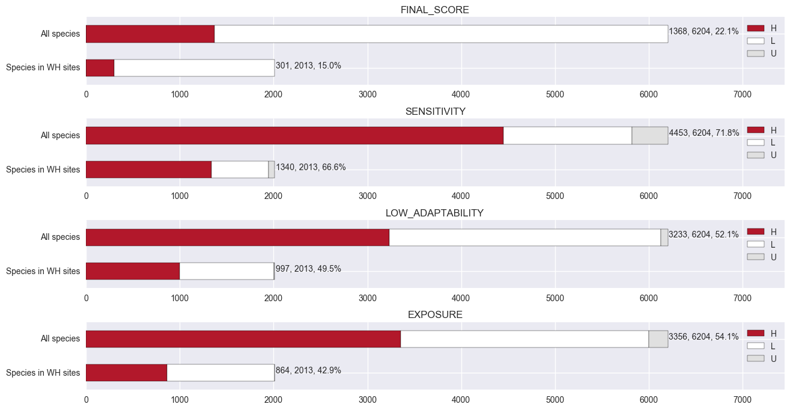
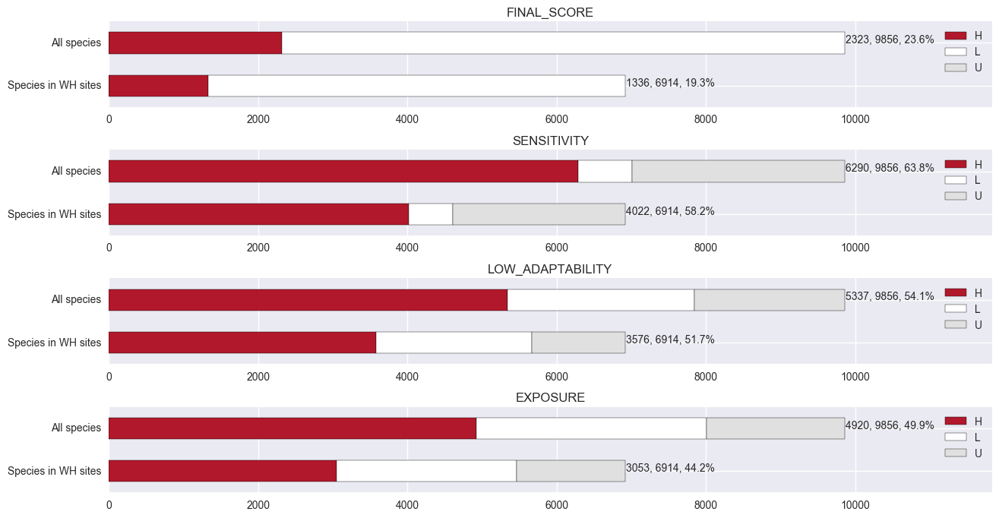
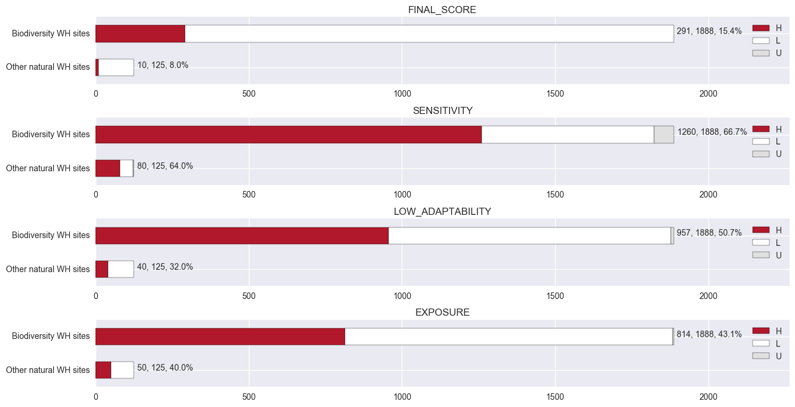
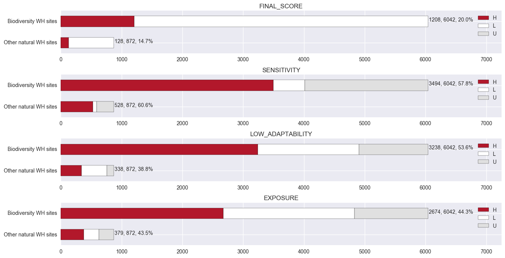
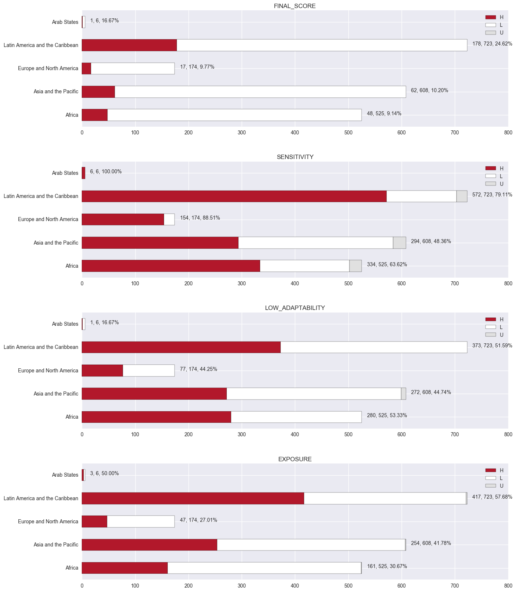
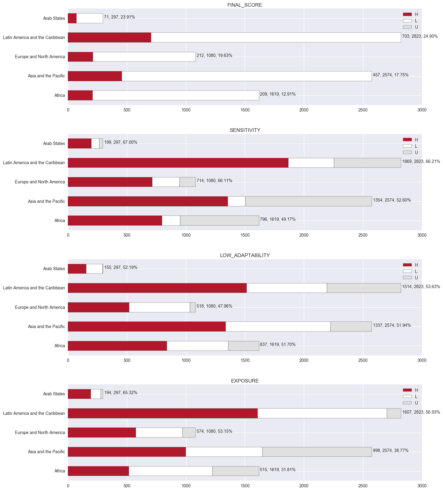

# Species climate vulnerability and natural World Heritage sites

## Background

Climate change affects all protected areas, including World Heritage (WH) sites. Biodiversity WH sites contain outstanding biological processes, threatened species and endangered habitats, and their long term conservation may be particularly vulnerable to climate change. It is imperative to better understand both the severity and the sources of impact, in order to mitigate this with informed, appropriate management responses to ensure that their Outstanding Universal Value (OUV), for which they are inscribed as WH sites, remains intact and conserved for future generations.

Thanks to a traits-based climate change vulnerability (CCV) assessment by IUCN's Global Species Programme ([Wendy et al 2013](http://journals.plos.org/plosone/article?id=10.1371/journal.pone.0065427)) - where all amphibians, birds, and reef-building warm water coral were assessed for their sensitivity, low adaptability and exposure - it is possible and straightforward to identify, through the lens of these species, the most sensitive and exposed WH sites.

This study aims to undertake a desk-base analysis, using existing CCV assessments, for all natural WH sites, especially those under criteria (ix) and (x). The aim is to enhance our understanding of climate vulnerable World Heritage sites in general, as well as individually, from the point of view of climate vulnerable amphibians, birds and corals.

## Key findings

Both results of amphibians and birds are summarised below. Information on detailed comparisons of each trait and exposure can be found in the [analysis workbook](./workspace.ipynb). Note that the sample of corals in WH sites is not statistically significant and therefore no further summary is made.

### Significant, but lower proportions, of species are climate change vulnerable in the global WH network

**15.0% of amphibians inside the WH network are vulnerable to climate change**, compared to 22.0% of all amphibians that are vulnerable globally, indicating that amphibians are less vulnerable inside natural WH sites. Similar patterns can be found in each category of sensitivity, low adaptability and exposure, where lower proportions of amphibians score 'high' inside WH sites. 

<!-- Similar to the global trend, amphibians in WH sites also face a low dispersal capacity (24.9%) and in terms of generation turnover many species remain unknown (more than 30%). -->

---

**19.3% of birds inside the WH network are vulnerable to climate change**, compared to 23.6% vulnerable globally. There seems to be significantly more bird species within WH sites (~70%, compared to 32.4% for amphibians). Whilst, notably, there are a significant number of bird species with unknown sensitivity, low adaptability and exposure scores, the result resembles that of amphibians: with lower proportions of birds in all categories inside WH sites.

---

### More species are climate change vulnerable in biodiversity WH sites than in other natural sites

**15.4% of amphibians in biodiversity WH sites are vulnerable to climate change compared to 8% in other natural WH sites**. As expected, significantly more species are found in biodiversity WH sites and  comparatively higher proportions of them are vulnerable overall, as well as within each category.

---

**20.0% of birds in biodiversity WH sites are vulnerable to climate change, compared to 14.7% in other natural WH sites**. Across sensitivity, low adaptability and exposure scores, there seems to be a higher degree of variation between biodiversity sites and other natural sites. Notably, a lot of birds have unknown scores, and out of those with known scores, most score 'high' in sensitivity, irrespective of biodiversity WH designation.

---

### There is a considerable regional variation across WH sites in hosting climate vulnerable species

**WH sites in Latin America and the Caribbean have the highest number and proportion of climate vulnerable amphibians**

---

**WH sites in Latin America and the Caribbean have the highest number and proportion of climate vulnerable birds**. 

---
## Discussions
<!-- There are substantial proportions of climate change vulnerable species inside WH sites. In the case of birds, one in five in WH sites are vulnerable to climate change

however, if compared globally the figure seems significantly lower. In both cases of amphibians and birds, fewer of them are sensitive, with low adaptability and exposed. This may reflect the fact WH sites are protected areas, and very often stringent protection and management schemes are in place and better enforced, therefore their habitats are more likely to be intact and undisturbed. 

The difference in species climate vulnerability between biodiversity and other natural WH sites for reflects WH criteria. In the case of amphibians, where substantially more species are found in biodiversity sites,  -->

## Methodology

### The overlap of Red List species and WH sites

The information for species inside WH sites remains incomplete at best, with some WH sites missing species records entirely. Moreover, in cases where such information is available, it is often non-standardised and not verified, and many cannot be linked to other species databases, such as the CCV assessments, without significant efforts (for example, reconciling names and/or taxonomic changes). To obtain this information, we instead chose to calculate based on the spatial relationship between species range polygons from the Red List and boundaries from the World Database on Protected Areas (WDPA); both are spatially explicit. 

To this end, a spatial overlay was computed between the two datasets, in order to identify potential species inside WH sites. Species intersecting a small area (absolute small size) and a small proportion (relative small size) of WH sites, were excluded. This removed false positives due to inaccurate and mismatching spatial boundaries, which may be due to different scales at which polygons had been mapped. 

In this analysis, only species distributions with presence code 1-2, origin 1-2 and seasonality 1-3 were considered. They were then dissolved to remove the effect of duplicates and double counting. The end result is a non-spatial table with unique pairs of WH sites and species, with their associated attributes.

### Utilising the climate change vulnerability assessments

Using species IDs, the CCV assessments of amphibians, birds and corals were joined, separately, by the partial overlap table from the overlay analysis. This enabled climate vulnerability information to be transferred, via partially overlapping species, to each World Heritage site. Then, by grouping species CCV scores accordingly, one type of analysis was developed to examine each WH site individually, and the other assessing the entire WH network as a whole.

More specifically, the following were calculated:

1. The number and proportion of species scoring 'high' in each trait category (sensitivity, low adaptability), and exposure.  
2. Comparison of the results between species found inside the WH network and globally
3. Based on the above results, comparisons between biodiversity and non-biodiversity sites, and by region.

It is possible that the difference to be observed reflects a random sampling process. Therefore, a bootstrap method was utilised for statistical significance testing, where the sample, i.e., species in WH sites, was repeatedly re-sampled with replacement 1,000 times to derive an empirical distribution.

## Caveat and interpretation

### Species inside WH sites

Due to the nature of using spatial boundaries to determine which species occurs in WH sites, the result relies heavily on the quality, in terms of both accuracy and precision, of the input datasets, the Red List and the WDPA. It is possible that range polygons/boundaries have been mapped at different scales, and thus the overlay operation may result in artifacts of false overlaps. It is therefore necessary to use a threshold to remove such commissions errors. To this end, a series of sensitive analyses were carried out to determine the effect of different thresholds. This approach is not perfect and remains an experiment of trial and testing, but by using such a threshold, 'false positives' should be considerably reduced.

In addition, the fact that Red List species polygons represent Extent of Occurrence (EOO) and not Area of Occupancy (AOO) suggests that, in some cases, even a species with 100% overlap with WH sites may still be absent. This should, however, be very rare, especially for endemic and range restricted species, due to the general large size of these sites and thus should introduce little error for further analysis. 

### Species climate change vulnerability assessment is relative

The upper 25% of assessment for any trait/exposure - such as sensitivity, low adaptability and exposure - for each taxon is classified as 'high' ([Wendy et al 2013](http://journals.plos.org/plosone/article?id=10.1371/journal.pone.0065427)). Because the measure is relative within the taxon of interest, comparisons cannot be made between taxa, and any interpretation or generalisation across taxa would be incorrect and meaningless.

### Comparisons between WH sites and across regions are relative

Due to the relative nature of species climate vulnerability assessment, aggregated results for each WH site, and comparisons between different regions are also relative, and only make sense for a given taxon.

### Significant number of unknown scores

Currently, all unknown scores are implicitly handled as if they were 'low'. The effect of this propagates from the very lowest level (for each trait), all the way to the final score. As it currently stands, it represents the most conservative or positive scenario for climate change vulnerable analysis. This may change when better information is made available.

## Reference
Foden WB, Butchart SHM, Stuart SN, Vié J-C, Akçakaya HR, Angulo A, et al. (2013) Identifying the World's Most Climate Change Vulnerable Species: A Systematic Trait-Based Assessment of all Birds, Amphibians and Corals. [PLoS ONE 8(6): e65427. doi:10.1371/journal.pone.0065427](http://journals.plos.org/plosone/article?id=10.1371/journal.pone.0065427)